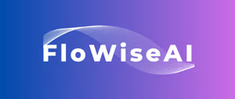

# GenAI's Lamp - Flowise Flows

Some GenAI's Lamp videos are based on the [Flowise](https://github.com/FlowiseAI/Flowise) open source tool.

You wished to try the flows yourselves? The GenAI's Lamp makes it come true!

* [OpenAI Chat](https://github.com/worldline/GenAI-Lamp/blob/main/Flows/OpenAI%20Chat%20Chatflow.json): simple Chat with OpenAI API
* [VertexAI RAG](https://github.com/worldline/GenAI-Lamp/blob/main/Flows/VertexAI%20RAG%20Chatflow.json): simple RAG pattern with Google VertexAI APIs
* [Falcon RAG](https://github.com/worldline/GenAI-Lamp/blob/main/Flows/Falcon%20RAG%20Chatflow.json): simple RAG pattern with Hugging Face APIs and Falcon model
